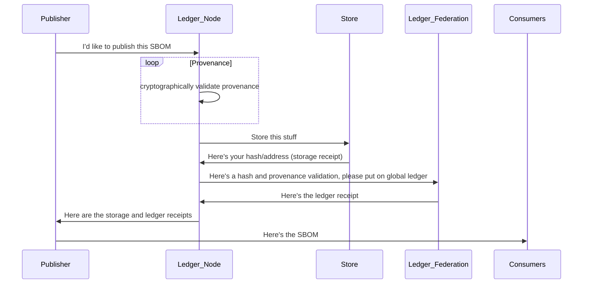
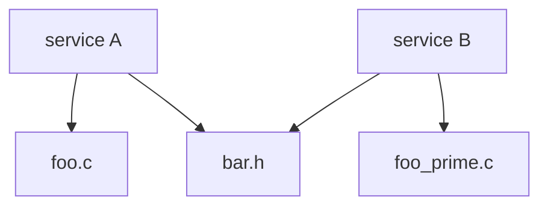
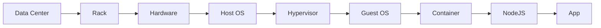

# BOM Sage Vision

The Internet has been built from small, simple pieces that have composed to
create a global mechanism for more than half the humans on the planet to
communicate and interact.

As we explore a global source of software truth, we must also ensure that
we can trust the source of truth.

We must also ensure that the truth is guarded by a federation of entities
we can trust.

We must create a balance of cryptographic surity and human judgment.

And we must make it easy for all participants in the software ecosystem
to participate.

Tall order.

## The quick overview

BOM Sage is composed of:

* A global, open, content addressable, reliable, fault tolerate storage system for the BOMs (the store)
* A global, open, federated ledger of all BOMs added to the store (the ledger)

The storage system could be (and in the first set of prototypes will be) the 
[Interplanetary File System](https://ipfs.io/) The IPFS is content-addressable. Objects stored in
the IPFS are hashed and the address of the object is its hash. This is a powerful cryptographic
property and allows for layering of things like [Merkle Trees](https://en.wikipedia.org/wiki/Merkle_tree).

The ledger could be (and in the first set of prototypes will be) based on federation of
servers running [Byzantine fault tolerant](https://en.wikipedia.org/wiki/Byzantine_fault) algorithm.
An example is [VMWare's Concord](https://github.com/vmware/concord-bft).

Membership in the ledger federation will be controlled by humans using similar protocols
to evaluation of certificate authorities.

An entity wanting to publish an SBOM (including a GitBOM tree), the "publisher" will submit the proposed SBOM
to a ledger node. The ledger node will validate [provenance claims](https://wiki.spdx.org/view/Technical_Team/SDPX_2.0_Provenance)
and if the provenance checks out, the ledger node will publish the SBOM to the store. Once published
to the store, the ledger node will publish an entry on the ledger including information regarding provenance
validation. Once published to the ledger, the ledger node will inform the submitting entity of
the root node in the store and the ledger node created memorializing posting to the store.

The publishing entity can then publish other or both of the reciepts publicly and the reciept for the
entry into the store will satisfy SBOM publishing requirements.

All of the above can be accessed via HTTPS requests and REST services. There would be no need for
consumers of the store or the ledger to interact directly with IPFS or a distributed ledger.

## Complex SBOMs

The way GitBOM descibes an [artifact tree](https://gitbom.dev/glossary/artifact_tree/#running-c-executable-with-shared-object).
Each node in the GitBOM tree would be a separate entry in the store. And across many packages, the tree becomes
a [directed acyclic graph](https://en.wikipedia.org/wiki/Directed_acyclic_graph).

In this case, two different Ledger Nodes could publish service A and service B at different times, but because `bar.h` is shared (or perhaps
its a library or a module or another artifact that's shared), there becomes a graph of dependencies.

If the shared thing was Log4J versions 2.0-beta9 to 2.14.1, it would be possible to see what depended on Log4J.

### Isn't this a security hole? I mean, you're telling hackers what to attack!

Sunlight is the best disinfectant.

Security by obscurity [has been rejected since 1851](https://en.wikipedia.org/wiki/Security_through_obscurity).

There will be a period where a global description of which systems have vulnerable components that will
increase attacks on those systems.

However, visibility will drive faster patching, faster responses to zero days, and generally better
hygene.

## Claims about proprietary software

The above examples are focused on open source software where the source code and perhaps the
git hash of the release and other things are part of the claim. However, there exists a class
of software for which revealing source code or distributing object code may negatively impact
a business. BOM Sage must deal with this case as well.

In order to make a claim about a system that the public cannot view, but the public must
be able to verify, the use of [Zero Knowledge proofs](https://en.wikipedia.org/wiki/Zero-knowledge_proof)
provide a solution.

Specifically, there are classes of Zero Knowledge proofs that allow verification that the
prover witnessed a document and made a hash of the document. This would allow the tracking
of a particular proprietary source file across many systems without revealing the contents of
the source file.

## Commercial opportunities

The above is open and not-for-cost. However, there must also be commercial opportunities
around BOM Sage.

Like [The Weather Channel](https://weather.com/) is a commercial user interface on top
of [NOAA](https://www.noaa.gov/) data, there are many commercial opportunities on top
of BOM Sage.

Specifically:

* Patch management prioritization systems and augmentations to existing vulnerability scoring/patch priority systems
* Reputation scoring by product and by vendor... and with reputation scoring comes improved vendor management
* Prioritized ledger submission... given that provenance validation may be computationally expensive, doing it faster
  could be a commercial offering much like GitHub and GitLab are commercial offering on top of git.
* Vulnerability prediction weather reports... as classes and clusters of vulnerabilities are discovered, predictive models
  can be built based on the global view.
* A "search engine" that will answer questions including "what nodes reference a given node" which will help with "what packages
  rely on Log4J 2.1?"

There are likely additional commercial offerings.

## Futures

In addition to the above, there are many possibilities for the future enabled
by a source of software truth.

[Remote Attestation (rats)](https://www.ietf.org/archive/id/draft-ietf-rats-architecture-12.html)
may simply become a part of the DAG of a system.

For example, a Merkle tree could be composed of application, container, operating system, hypervisor,
host operating system, and hardware. The identifier (hash of the root) could be returned as part of
every HTTP response.

And with this could be a sub-graph of services that were used to deal with a particular
request. With a the root of a Merkle tree/graph of services that touched the data, there
are a lot of interesting PCI and FedRAMP compliance tests as well as demonstrations around
data sovereignty (e.g., data from this request was only serviced within a particular geography).

