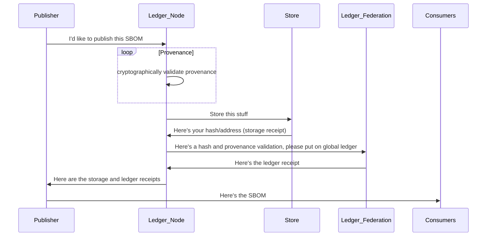
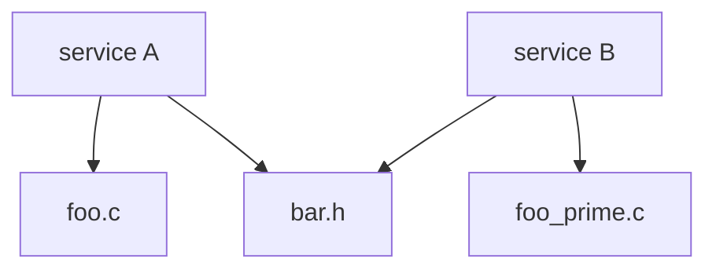

# BOM Sage Vision

The Internet has been built from small, simple pieces that have composed to
create a global mechanism for more than half the humans on the planet to
communicate and interact.

As we explore a global source of software truth, we must also ensure that
we can trust the source of truth.

We must also ensure that the truth is guarded by a federation of entities
we can trust.

We must create a balance of cryptographic surity and human judgment.

And we must make it easy for all participants in the software ecosystem
to participate.

Tall order.

## The quick overview

BOM Sage is composed of:

* A global, open, content addressable, reliable, fault tolerate storage system for the BOMs (the store)
* A global, open, federated ledger of all BOMs added to the store (the ledger)

The storage system could be (and in the first set of prototypes will be) the 
[Interplanetary File System](https://ipfs.io/) The IPFS is content-addressable. Objects stored in
the IPFS are hashed and the address of the object is its hash. This is a powerful cryptographic
property and allows for layering of things like [Merkle Trees](https://en.wikipedia.org/wiki/Merkle_tree).

The ledger could be (and in the first set of prototypes will be) based on federation of
servers running [Byzantine fault tolerant](https://en.wikipedia.org/wiki/Byzantine_fault) algorithm.
An example is [VMWare's Concord](https://github.com/vmware/concord-bft).

Membership in the ledger federation will be controlled by humans using similar protocols
to evaluation of certificate authorities.

An entity wanting to publish an SBOM (including a GitBOM tree), the "publisher" will submit the proposed SBOM
to a ledger node. The ledger node will validate [provenance claims](https://wiki.spdx.org/view/Technical_Team/SDPX_2.0_Provenance)
and if the provenance checks out, the ledger node will publish the SBOM to the store. Once published
to the store, the ledger node will publish an entry on the ledger including information regarding provenance
validation. Once published to the ledger, the ledger node will inform the submitting entity of
the root node in the store and the ledger node created memorializing posting to the store.

The publishing entity can then publish other or both of the reciepts publicly and the reciept for the
entry into the store will satisfy SBOM publishing requirements.

## Complex SBOMs

The way GitBOM descibes an [artifact tree](https://gitbom.dev/glossary/artifact_tree/#running-c-executable-with-shared-object).
Each node in the GitBOM tree would be a separate entry in the store. And across many packages, the tree becomes
a [directed acyclic graph](https://en.wikipedia.org/wiki/Directed_acyclic_graph).

In this case, two different Ledger Nodes could publish service A and service B at different times, but because `bar.h` is shared (or perhaps
its a library or a module or another artifact that's shared), there becomes a graph of dependencies.

If the shared thing was Log4J versions 2.0-beta9 to 2.14.1

