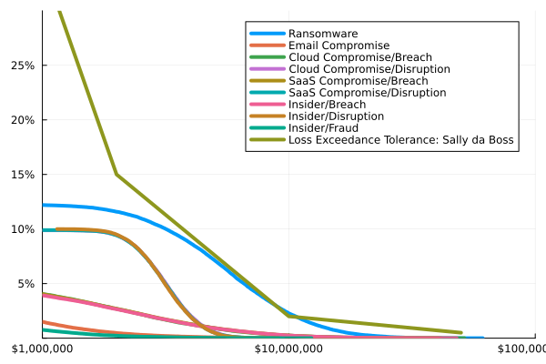

# Risky Business

A set of Julia scripts that perform simulations based
on risk estimations.

To run: `julia src/RiskyBusiness.jl`

Then: `open risky_business.png`

You should see something like:

This is similar to the Monte Carlo simulation and assocated graphs
from _[How to Measure Anything in Cybersecurity Risk](https://www.wiley.com/en-us/How+to+Measure+Anything+in+Cybersecurity+Risk%2C+2nd+Edition-p-9781119892311)_ Chapter 3.
